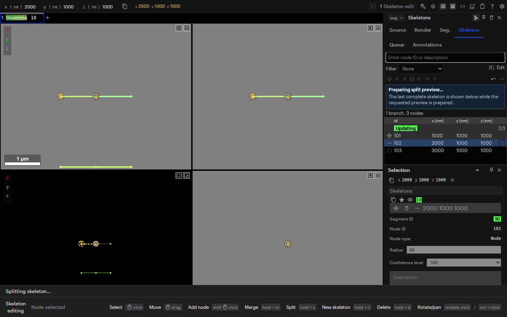
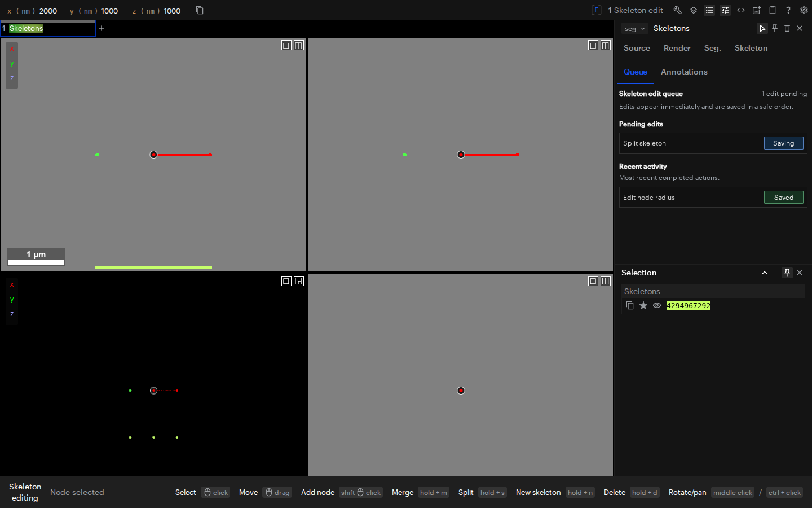
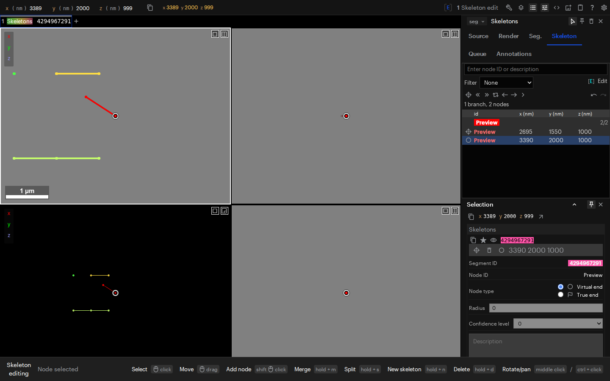

.. _optimistic-skeleton-edit-queue:

Skeleton editing
================

When you edit a skeleton, Neuroglancer shows a preview of the result and saves
it to CATMAID in the background. This lets you continue tracing while earlier
changes save. It applies to adding, moving, and deleting nodes; changing node
properties; rerooting; splitting and merging skeletons; and Undo and Redo.

.. _skeleton-queue-edit-gestures:

Edit a skeleton
---------------

1. Open your writable CATMAID layer. Make the skeleton visible in **Seg**, or
   double-click one of its nodes in the viewport.
2. **Hover over or select a node** to show that skeleton's node list in
   **Skeleton**. Allow its details to finish loading. Making the skeleton
   visible alone does not choose which skeleton's nodes the panel shows.
3. Activate **Skeleton editing** and make your edits. The preview appears as
   soon as it is ready; you can continue editing while earlier changes save.
4. Open the layer's **Queue** tab to check progress. **Saved** confirms that
   CATMAID saved the action and Neuroglancer applied the result locally.

For example, add a node and then add a child to it before the first save
finishes. Both appear in the preview. Neuroglancer saves them in order and
attaches the child to the correct parent once CATMAID returns its saved ID.

You can keep selecting, navigating, filtering, pinning, and changing visibility
while edits save. You can also use Undo and Redo when their controls are
available.

.. _skeleton-editing-tools:

Activate Skeleton editing
~~~~~~~~~~~~~~~~~~~~~~~~~

Activate **Skeleton editing** from the Skeleton tab. To assign it a shortcut,
click its key-binding box and press a free key, such as **E**. **Shift+E** then
activates the tool. Moving, adding, merging, splitting, creating a skeleton,
inserting, and deleting are modes of this one tool.

Use these gestures with **Skeleton editing** active and the pointer over a
viewport. Click means left-click. Release **M**, **S**, **N**, **D**, or **I**
to leave that mode after completing the gesture.

.. list-table::
   :header-rows: 1
   :widths: 25 75

   * - Action
     - Gesture
   * - Select a node
     - Click the node.
   * - Move a node
     - Drag the node to its new position.
   * - Add a child
     - Select its parent, then **Shift+click** where the child should go.
   * - Merge skeletons
     - Hold **M**, click the source node, then click the target node in the
       other skeleton.
   * - Split a skeleton
     - Hold **S**, then click a non-root node that is not marked as a true
       end. That node and its descendants become a separate skeleton.
   * - Create a new skeleton
     - Hold **N**, then click empty space to place its root node.
   * - Insert a node
     - Hold **I**, then click two directly connected nodes to insert a node
       at the midpoint of their edge.
   * - Delete a node
     - Hold **D**, then click the node to delete.

.. _skeleton-editing-insert:

Inserting a Node
~~~~~~~~~~~~~~~~

Hold :kbd:`I` and click two directly connected nodes: one must be the parent of
the other. The order of the two clicks does not matter. A new node is inserted
at the midpoint of the edge between them; it becomes a child of the parent node
and the new parent of the child node.

Because a node can have only one parent, two nodes that are not directly
connected are rejected and nothing is changed. The first node you clicked stays
selected so you can pick one of its neighbours instead. Both nodes must belong
to a visible skeleton.

Merge and split rules
~~~~~~~~~~~~~~~~~~~~~

Merge joins two skeletons through the source and target nodes you choose.
Start with the source skeleton visible and its node details available.
Neuroglancer fetches the target skeleton's details if needed before previewing
the merge. CATMAID decides which skeleton ID survives, and Neuroglancer follows
the saved result.

Split cuts the connection between the selected node and its parent. The
selected node becomes the root of a new skeleton with all its descendants;
the rest stays in the original skeleton. This produces two skeletons, even
when the selected node is a branch point or a leaf. The selected node must
have a parent and must not be marked as a true end. Its complete skeleton
details must be available before the split can start.

Rerooting, node properties, Undo, and Redo are also available through the
**Skeleton** controls.

.. _skeleton-editing-tab:

Inspect and navigate skeletons
------------------------------

The **Skeleton** tab is available for CATMAID layers with the spatially indexed
skeleton subsource active. Hover over or select a node to choose which
skeleton's details appear. Make the skeleton visible in **Seg**, or double-click
one of its nodes, to request its complete details. Making it visible alone
does not choose its node list. Previously fetched details may remain available
after a skeleton is hidden.

Find nodes by ID or description, or filter the list to show leaves, virtual
ends, true ends, or nodes with descriptions. Pin a selection to keep its
details in the panel while navigating elsewhere.

Navigate the tree
~~~~~~~~~~~~~~~~~

The Skeleton toolbar provides controls to:

- Go to the root.
- Go to the start or end of the current branch.
- Cycle through nodes at the current level.
- Go to the parent or a child of the current node.
- Go to the nearest leaf that is not marked as a true end.

In the node list, right-click a node to move to it, or left-click to select it
and move to it.

.. _skeleton-node-types:

Node types
~~~~~~~~~~

Node symbols indicate their place in the skeleton:

- **Root:** the root node of the skeleton.
- **Regular node:** an interior node along a branch.
- **Branch point:** a node with more than one child.
- **Virtual end:** a leaf that has not been marked as a true end.
- **True end:** a leaf marked by a reviewer as the end of a branch.

For a visible skeleton, click a leaf's type icon in the node list to toggle
between virtual end and true end.

.. _skeleton-node-properties:

Node properties
~~~~~~~~~~~~~~~

Show the skeleton, then select a node in its node list or use **Ctrl+right-click**
in the viewport (**Cmd+right-click** on macOS). The selected node's controls
let you change its radius, confidence, or free-text description. Depending on
the node, you can also delete it, change its end type, or make it the root.

These changes preview and save through the same queue as edits made in the
viewport. A read-only source still allows inspection, but disables editing.

Understand the visual cues
--------------------------

.. list-table::
   :header-rows: 1
   :widths: 25 75

   * - Cue
     - Meaning
   * - **Dashed yellow rings and lines**
     - A structural preview is being prepared. Rings mark known affected
       nodes; lines indicate the connection or path involved. The previous
       complete structure stays visible until the preview is ready.
   * - **Preview** in red
     - A new node or skeleton has a temporary identity while CATMAID assigns
       its saved ID. You can continue editing it. Red here does not indicate
       an error.
   * - **Updating** beside the skeleton
     - The panel retains the last complete shape while the next preview is
       being prepared. This shape can already include earlier edits that are
       still saving.

The letters or symbols inside dashed yellow rings identify the requested
change: **S** for split, **M** for merge, **R** for reroot, **×** for delete,
and **+** for restore, such as undoing a deletion. These cues disappear when
the complete preview replaces them, which may happen before the save finishes.
On small skeletons, preparation may finish too quickly to see the cues.

Here are examples of when they appear:

- **Split a branch:** while the split preview is being prepared, yellow **S**
  rings mark the cut node and its parent, with a dashed line along the
  connection being cut. The branch still looks attached during preparation.
  **Updating** in Skeleton means the list still describes that earlier shape.
  Once the preview is ready, the branch appears as a separate skeleton and
  the yellow cues disappear, even if Queue still says Saving.
- **Merge two skeletons:** yellow **M** rings mark the two chosen endpoints,
  with a dashed line showing the intended join while its preview is prepared.
  Once joined in the preview, the combined skeleton shows **Preview** in red
  until CATMAID confirms its saved skeleton ID. You can keep editing it.
- **Delete a node or undo a deletion:** a yellow **×** marks the node being
  deleted; **+** marks where a deleted node is being restored while that
  preview is prepared.
- **Choose a new root:** yellow **R** markers identify the requested root and
  the known path involved in rerooting while the preview is prepared.
- **Create a skeleton or add a child:** the new skeleton or node can show
  **Preview** in place of its ID while its save is pending. It is already
  available for further editing, such as adding another child.

These screenshots use demonstration skeletons. Preview preparation and server
replies were paused during capture so these brief states are easy to see.

**Split preparing:** the dashed yellow markers identify the connection between
nodes 101 and 102. The branch is still attached, and **Updating** labels the
existing three-node skeleton in the panel.

**Split saving:** the connection has disappeared in the preview. The yellow
markers are gone, but **Queue** still shows **Saving**.

**New skeleton with a child:** the node list shows **Preview** for the new
skeleton and both nodes while the first save is pending. The child was added
without waiting for the root's saved ID.

A visible preview or a permanent numeric ID alone does not confirm that all
pending edits have saved. Use **Queue** to check completion.

Check progress in Queue
-----------------------

**Pending edits** shows unfinished actions in the order you requested them.
Completed actions move to **Recent activity**.

.. list-table::
   :header-rows: 1
   :widths: 30 35 35

   * - Status
     - Where it appears
     - What it means
   * - **Preparing**
     - Pending edits
     - Neuroglancer is building the preview. Some controls may briefly be
       unavailable.
   * - **Queued**
     - Pending edits
     - Your preview is ready and waiting for its turn to save.
   * - **Saving**
     - Pending edits
     - CATMAID is processing the action.
   * - **Reconciling**
     - Pending edits
     - CATMAID has replied and Neuroglancer is applying the saved result
       locally. This is usually brief.
   * - **Saved**
     - Recent activity
     - CATMAID saved the action and Neuroglancer applied the result locally.
   * - **Reverted**
     - Recent activity
     - Pending actions canceled each other locally, such as an edit followed
       by Undo, without saving those actions.
   * - **Not saved**
     - Recent activity
     - The action failed or was canceled. See the failure guidance below
       before trying again.
   * - **Reload required**
     - Pending edits and a persistent alert
     - Neuroglancer cannot reliably match its local skeleton to CATMAID.
       Editing, Undo, and Redo are blocked until you reload and inspect the
       saved result.

Recent activity keeps **64 completed actions by default**, ordered newest
requested action first. Once there are more than 64, the oldest rows leave
the list; rows do not expire after a set amount of time. Removing a row does
not remove a saved change or decide whether it can still be undone.

**Undo and Redo each add their own activity row.** For example, moving a node
and then undoing the move produces a Move row and an Undo row. Undo does not
delete the Move row. Both count toward the 64-row limit, even if they cancel
locally and show Reverted.

.. _skeleton-editing-undo:

.. _skeleton-queue-undo-redo:

Undo and Redo
-------------

Use **Undo** and **Redo** in the Skeleton toolbar. Undo works backwards through
your latest edits, including changes that are still waiting to save.
The page retains the edit information they need, so you do not have to show
a hidden skeleton again before using Undo or Redo.

- **Before saving starts:** Undo can remove the preview without sending the
  edit to CATMAID. Recent activity may show Reverted. Redo can reapply it.
- **While saving is in progress:** Undo can restore the earlier appearance
  immediately. The original save finishes first, then Neuroglancer saves the
  undo. Wait for both to finish before treating the result as saved.
- **After an edit is saved:** Undo and Redo create their own previews and save
  in turn, just like other actions.

For example, create a new skeleton, then click Undo and Redo while its first
save is still in progress. The node disappears and reappears immediately.
It stays visible while the original creation, Undo, and Redo save in order.
Wait for the queue to finish before leaving the page.

Undo/Redo retains **64 original edits by default**, shared between what you
can undo and what you can redo. Undo and Redo move an existing edit between
those two groups; they do not use another history slot. New edits enter this
history as soon as they are accepted, before saving finishes.

**History controls what the Undo and Redo buttons can do. Recent activity is
a log of what happened.** Both default to 64, but they count different things:

.. list-table::
   :header-rows: 1
   :widths: 30 35 35

   * - What you do, starting with empty history
     - Undo/Redo choices
     - Recent activity after the actions finish
   * - Move one node, then Undo it
     - One original edit is retained: nothing to Undo, one move to Redo.
     - Two rows: Move and Undo.
   * - Move one node, then repeat Undo followed by Redo 32 times
     - Still one original edit: one move to Undo, nothing to Redo.
     - 65 actions have completed. Only the latest 64 rows are shown; the
       original Move row has left the log, but the move is still available to
       Undo.
   * - Make 65 consecutive new edits, allowing them to save
     - Only the latest 64 edits can be undone. The first edit has left
       history.
     - Only the latest 64 actions are shown.

Making a new edit after Undo clears the Redo choices immediately. If the new edit is rejected without changing CATMAID and recovery
succeeds, those Redo choices return. Reloading the page or replacing the
skeleton layer clears history. A disabled button's tooltip explains why the
action is currently unavailable.

Undoing a split or merge restores the structure, but CATMAID may assign new
skeleton or node IDs. One Undo can require several saving steps. All those
steps must succeed before the Undo is marked Saved.

When the queue is full
----------------------

The queue accepts **64 unfinished actions by default**. Actions count while
preparing, waiting to save, saving, or applying the saved result locally.
Undo and Redo normally each count as an action; an action with several server
steps still counts as one.

At that limit, a new edit is not accepted. Wait until a pending action finishes
or is canceled, then try again. Saved actions and Recent activity rows do not
occupy queue space.
Undo may still be available at the limit if it can cancel an unsent action
locally and free space.

If something needs attention
----------------------------

An action asks you to inspect the skeleton
~~~~~~~~~~~~~~~~~~~~~~~~~~~~~~~~~~~~~~~~~~

Make the skeleton visible in **Seg**, or double-click one of its nodes. Hover
over or select a node so its node list appears in **Skeleton**, wait for the
details to finish loading, then repeat the action. A few points in the viewport
can be shown before the full skeleton details needed for editing are available.

An action rejected with this inspection message has not added anything to
Queue or history. When a merge needs to fetch the second skeleton's details,
it waits up to two minutes. If that fetch fails, no merge is queued; you can
show the second skeleton's details and try again.

A save is taking a long time
~~~~~~~~~~~~~~~~~~~~~~~~~~~~

A warning appears if a save request takes more than **30 seconds**. The
warning does not cancel the request or mean it failed. Check your connection
and Queue, and let the pending request finish before repeating that action.

What happens when an action fails
~~~~~~~~~~~~~~~~~~~~~~~~~~~~~~~~~

The status depends on what happened to the saved data and whether Neuroglancer
can restore a reliable local view:

.. list-table::
   :header-rows: 1
   :widths: 30 35 35

   * - Status
     - When it appears
     - Can I make a new edit?
   * - **Not saved**
     - The action was rejected without changing CATMAID, and Neuroglancer
       successfully removed its preview and canceled later pending actions.
       Those canceled actions also show Not saved.
     - **Yes.** Read the error and correct the cause first. The queue accepts
       new actions after recovery finishes.
   * - **Reload required**
     - The save outcome is uncertain, an action only partly saved, or
       Neuroglancer cannot reliably apply or roll back the result locally.
     - **No.** The queue rejects new edits, Undo, and Redo until the page is
       reloaded. Waiting for queue space does not clear this state.

If a Reload required alert appears alongside a Not saved row, follow the
alert: editing stays blocked until reload.

When an edit fails without changing CATMAID and recovery succeeds,
Neuroglancer removes its preview and every later pending preview. This includes
later edits to other skeletons in the layer. **Earlier changes and their
Undo/Redo choices remain available.** An earlier edit that is still saving
continues normally.

For example:

1. You change a node's description from “unreviewed” to “checked” and wait for Saved.
2. You move that node from position A to position B, then add a child before
   the move finishes saving.
3. CATMAID rejects the move. Neuroglancer removes the move preview and cancels
   the pending child. The node returns to A, the child disappears, and both
   actions show Not saved. The saved description is still “checked”.
4. After correcting the cause of the error, you can use Undo to restore the
   description to “unreviewed”, or continue with a new edit.

.. list-table::
   :header-rows: 1
   :widths: 25 75

   * - Action that was rejected
     - What happens to Undo/Redo after successful recovery
   * - A new edit
     - That edit and later actions leave history. Earlier Undo choices remain,
       and any Redo choices cleared by the rejected edit return. Redo does not
       retry the failed new edit.
   * - Undo
     - The original edit returns to Undo. After correcting the cause, you can
       try Undo again.
   * - Redo
     - The original edit returns to Redo. After correcting the cause, you can
       try Redo again.

Read the error, inspect the remaining skeleton, and correct the problem before
continuing. Canceled actions are not retried automatically. Recent activity
keeps its record of completed actions; it does not determine which edits can
be undone or redone. If recovery requires a reload, the entire Undo/Redo history
is cleared instead.

**If Reload required is present**, use **Reload page** in the alert. Show the
affected skeletons in **Seg**, then hover over or select their nodes to check
what CATMAID saved before repeating an action. Selection, navigation, and
inspection remain available while editing is blocked. Replacing the layer
does not clear the alert; Neuroglancer does not automatically retry or undo
an uncertain result.

Before you leave
----------------

Wait until Pending edits is empty and check Recent activity for failures
before closing the page, reloading, or removing the layer. An empty pending
list alone does not mean every action succeeded.

Closing or replacing the layer discards actions that have not started saving.
Requests already sent may still change CATMAID. Removing the layer is therefore
not a way to undo an edit. After an unexpected interruption, show the affected
skeletons and check the saved result before continuing.

.. _skeleton-editing-sources:

Source setup
------------

If your writable CATMAID layer is already configured, use it as described above.
This section covers connecting a source and configuring its display.

CATMAID requirements
~~~~~~~~~~~~~~~~~~~~

Skeleton editing currently supports CATMAID sources. The server needs:

- CATMAID ``2026.05.06.dev11+g...`` or later by git-describe version ordering.
- A CATMAID project and a linked project stack.
- CATMAID read permissions for anonymous access or a personal API token.
- CATMAID edit permissions for the token account when editing is enabled.
- Cross-origin access for the Neuroglancer origin and authorization headers.
- Skeletons initialized for that project.

CATMAID coordinates are in nanometers. Neuroglancer uses the linked stack's
dimensions multiplied by its resolution to determine the project bounds.

The linked stack can define spatial skeleton metadata, with one entry in
``spatial`` for each index level:

.. code-block:: json

   {
     "spatial": [
       {
         "chunk_size": [11168145, 11168145, 11168145],
         "limit": 500
       },
       {
         "chunk_size": [3939000, 3939000, 3939000],
         "limit": 7000
       }
     ],
     "cache_provider": "cached_msgpack_grid",
     "read_only": false
   }

``chunk_size`` uses CATMAID project-space nanometers. Each level requires a
``limit``, the maximum expected node count. A limit of ``0`` means complete,
unlimited results and is allowed only on the finest level. The optional
``cache_provider`` is passed to CATMAID's node-list requests.

Set ``read_only`` to ``false`` to allow editing. Otherwise the source supports
inspection only. If ``spatial`` is absent or empty, Neuroglancer derives a
default chunk size from the project bounds and uses ``limit: 0``.

After setting this up, enter
``catmaid:<your-catmaid-server-url>/<your-catmaid-project-id>`` as a data
source in Neuroglancer. Public projects use CATMAID's anonymous API token.
Private projects prompt for a personal API token, which is retained for the
current browser tab. Python-hosted viewers can configure the token with
``neuroglancer.set_catmaid_token`` or ``CATMAID_CREDENTIALS``. See
:ref:`catmaid-datasource` for authentication and CORS details.

.. _skeleton-editing-subsources:

Layer subsources and display
~~~~~~~~~~~~~~~~~~~~~~~~~~~~

The data source exposes a single spatially indexed skeleton subsource, which is
required for editing.
The **Seg** tab controls skeleton visibility by ID or by an assigned label.

Showing a skeleton requests its complete nodes and details. Allow that request
to finish. Otherwise, the viewport may show only the points supplied by the
spatial index for the current view. **Spacing (cross section)** and
**Spacing (projection)** control the selected index level.

In **Render**, **Opacity (3d)** controls fully loaded visible skeletons.
**Hidden Opacity (3d)** controls the spatially indexed indicators for hidden
skeletons.

.. _skeleton-editing-find-path:

Find Path
---------

Click **Find Path** in the skeleton tab, then left-click the source node followed
by the target node. You may also hold :kbd:`Shift` while selecting. Both
endpoints must be distinct, exact nodes in the same skeleton segment; points on
edges are not accepted. A third selection is ignored until an endpoint is
removed or the tool is cleared. The endpoint rows show each node's derived
topology type and coordinates; hover a row to see its node ID.

The route is computed automatically after the target is selected and displayed
as a white annotation polyline. **Find Path** uses complete skeleton data already
cached in the client and does not initiate a download. A cached skeleton can be
used even if it is no longer visible. If the skeleton is not cached, make it
visible and wait for the normal visibility pipeline to load it; the route is
computed automatically when loading completes. Click **Clear** to remove the
endpoints and route. Deleting the route annotation has the same effect as
**Clear**. If a generic skeleton contains cycles, **Find Path** selects a
deterministic route with the fewest edges.

While Find Path is active, use the middle mouse button to navigate. Control plus
left mouse provides the same trackpad-friendly navigation alternative as the
Edit tool.

The spatial skeleton tool supports one active spatial skeleton datasource per
segmentation layer. Switching Find Path to another datasource while the layer
is loaded is not supported. Find Path state is saved with its datasource.
